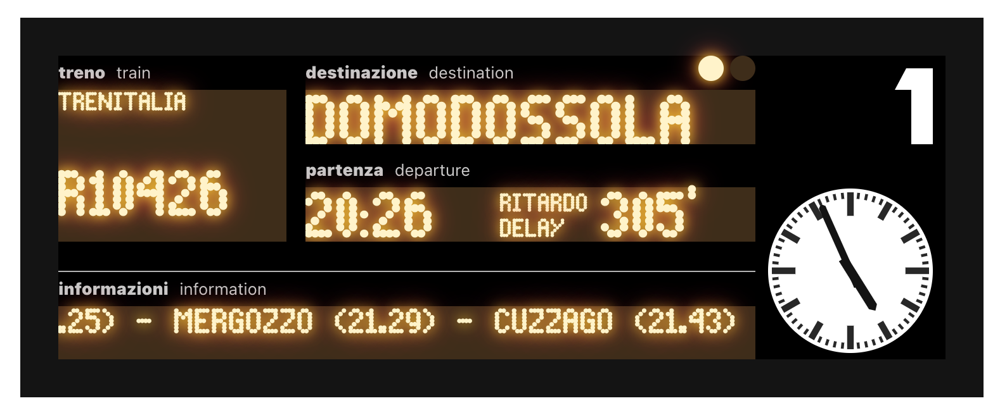

# Trenitalia train board in pure CSS

## Uso

Clona il tutto e apri `index.html` nel tuo browser.

## Personalizza

Apri `index.html` e cambia qualsiasi cosa tu voglia cambiare.

## Limiti e miglioramenti

- L'orologio è fermo sulle 5
- Non ci sono effetti tridimensionali
- Il font non è quello corretto
- Non ho idea della licenza del font
